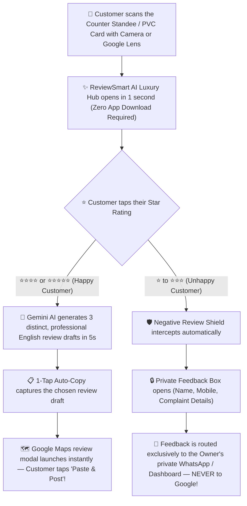

# 🚀 ReviewSmart AI — Field Marketing Cookbook & Sales Closer Playbook (2026 Edition)
> **The Official Field Sales Playbook, Objection Handling Bible & Mohan's Merchant Onboarding Protocol**  
> **Our Mission:** Empower local retail merchants, doctors, restaurants, salons, and showrooms to dominate Google Maps in **under 5 minutes**!  
> **Official Platform:** [https://reviewsmart.online](https://reviewsmart.online) • **Agent POS Portal:** [https://reviewsmart.online/agent](https://reviewsmart.online/agent)

---

## 🧭 Part 1: What Are We Really Selling? (The Core Value Proposition)

We are **NOT** selling another generic software subscription, app, or plastic stand.  
We are selling:
1. **A Continuous Influx of High-Paying Walk-in Customers via Top Google Maps Ranking.**
2. **A 100% Private Shield Against Reputation-Destroying 1-Star Negative Reviews.**
3. **A Prestigious, Dual-Sided Executive Counter Terminal (Crystal Acrylic Standee + Smart PVC Card).**

---

### The 2 Fatal Problems Every Local Business Owner Faces:
1. **99% of Happy Customers Leave Without Writing a Review:** Customers finish their meal, purchase, or haircut, walk up to the cash desk, and leave. Nobody wants to open Google Maps, search for the shop name, and type a 3-paragraph review on a small keyboard.
2. **The 1 Unhappy Customer ALWAYS Leaves a Venomous 1-Star Review:** An impatient customer who waited 10 minutes at the billing desk will spend 15 minutes drafting a vicious 1-star review. It stays permanently on Google, scaring away dozens of future walk-in customers.

---

### How ReviewSmart AI Solves This in 10 Seconds Flat:



---

## 🌟 Our 4 Unfair Competitive Advantages

1. **Official Google "G" Circle Badge (100% Scan Trust):**  
   Every standee and PVC card features the authentic Google "G" emblem enclosed in an ultra-clean white circular badge. Customers immediately recognize it as an official review station and scan without hesitation.
2. **Dual-Sided Smart PVC Card (Front: Google Station • Back: Merchant Business Card):**  
   - **Front Side:** Official Google 5-Star Station with zero-reprint dynamic QR code and NFC zone.
   - **Back Side:** The merchant’s custom luxury visiting card (Proprietor Name, Title, Phone, Email, Address), an exact photographic snapshot of their physical paper card, or their Direct UPI Payment QR.
3. **Universal Compatibility for Older Smartphones (Google Lens & Payment QR Scanners):**  
   Newer iPhones and Androids scan instantly with the built-in camera. If an older smartphone does not have a native QR scanner, customers can simply tap the **Google Lens** icon on their home screen or scan using **PhonePe / Google Pay / Paytm**. Zero app downloads needed!
4. **100% Ad-Free & Zero-Reprint Guarantee:**  
   Unlike cheap free QR generators that bombard customers with scammy popup ads, gambling links, or slow redirects, ReviewSmart AI is 100% ad-free, blazing fast, and ultra-secure. Furthermore, if the merchant ever changes their phone number, location, or menu, the QR code **never** needs to be reprinted—it updates dynamically from the cloud in 1 second!

---

## 📦 Part 2: The Hardware Deliverables Defense (Transparent Tiered Pricing)

> [!IMPORTANT]
> **The Golden Pricing Rule (The Deliverables Defense):**  
> *"ReviewSmart AI NEVER charges different prices for the same product. Our price points are 100% anchored in physical counter hardware units and display configurations!"*  
> If Merchant A asks why Merchant B paid ₹1,999 while they are being quoted ₹2,499, the answer is simple and indisputable:  
> *"Merchant B purchased our compact single-card Starter PVC pack for their small takeaway desk. Your store is getting the flagship 4″×6″ Crystal Acrylic Counter Standee Kit + Dual-Sided PVC Card!"*

| Package Tier | Official Price | Physical Hardware Deliverables Included | Ideal Business Profile |
| :--- | :---: | :--- | :--- |
| **Starter PVC Card Pack** (`STARTER_PVC`) | **₹1,999** | • **1x Dual-Sided Vertical PVC Smart Card** (CR80)<br>• Front: Google 5★ Station & Dynamic QR<br>• Back: Luxury Visiting Card / UPI QR<br>• Lifetime Gemini AI Engine & WhatsApp Shield | Single billing desks, takeaway counters, coffee stalls, food trucks, mobile professionals |
| **Executive Counter Standee Kit** (`EXECUTIVE_STANDEE`) | **₹2,499**<br>*(Best Seller ⭐)* | • **1x 4″×6″ Crystal Acrylic Counter Standee**<br>• **1x Dual-Sided Vertical PVC Smart Card**<br>• Official Google "G" Circle Trust Badge<br>• Lifetime Gemini AI Engine & WhatsApp Shield | Clothing boutiques, restaurants, dental clinics, jewelers, beauty salons, retail showrooms |
| **All-in-One Multi-Counter Hub** (`ALL_IN_ONE_HUB`) | **₹2,999 – ₹3,999** | • **1x 4″×6″ Crystal Acrylic Counter Standee**<br>• **2x Dual-Sided Vertical PVC Smart Cards**<br>• **1x A4 Framed Glass-Door Wall Poster**<br>• Multi-station staff attribution & Digital Menu | Multi-counter showrooms, hospitals, multi-floor restaurants, luxury studios |
| **Additional Branch Pass** (`ADDON_BRANCH`) | **₹999 / branch** | Dedicated branch URL + Counter Standee Pack | Chain franchises & multi-location owners |

---

## 💰 Part 3: Agent Earnings & Commission Structure

- **Standard Field Commission:** **30% spot commission** on every verified deal closed!
- **Star Leader / Senior Closer Tier:** Top performers closing 50+ deals/month (e.g. Madhu MKT-01) can be upgraded to **up to 40% commission** by Mohan.
- **Instant Payout Release:** Commissions are cleared immediately once Mohan verifies your WhatsApp onboarding packet and approves the transaction in the Admin Console.

| Daily Target | Average Deal Closed | Daily Sales Volume | **Your Daily Commission (30%)** | **Your Monthly Income (26 Days)** |
| :--- | :---: | :---: | :---: | :---: |
| **2 Deals / Day** (Starter PVC) | ₹1,999 | ₹3,998 | **₹1,200 / day** | **₹31,200 / month** |
| **3 Deals / Day** (Executive Standee) | ₹2,499 | ₹7,497 | **₹2,249 / day** | **₹58,474 / month** |
| **4 Deals / Day** (Executive + VIP) | ₹2,699 | ₹10,796 | **₹3,238 / day** | **₹84,188 / month** |
| **5 Deals / Day** (Top Closer / 40% Tier) | ₹2,999 | ₹14,995 | **₹4,498 – ₹5,998 / day** | **₹1,16,948 – ₹1,55,948 / month** |

---

## 🎒 Part 4: Pre-Field Morning Readiness Checklist (Before 9:30 AM)

Every field marketing agent must verify these 6 items before stepping out into the commercial market:
1. **Smartphone & Connectivity:** Battery at $\ge 90\%$ + fast 4G/5G mobile internet. Your phone is your POS cash register and live demo terminal.
2. **Agent Portal Login:** Logged into `https://reviewsmart.online/login` using your registered 10-digit mobile number and 4-digit PIN.
3. **Commission Privacy Mode:** On the `/agent` dashboard, tap the **eye icon** in the Earnings card so your balance displays as `••••`. Never let merchants see your commission percentage.
4. **Physical Demo Bag:**
   - 1x Sample 4″×6″ Crystal Acrylic Counter Standee.
   - 1x Sample Dual-Sided Vertical CR80 PVC Smart Card.
5. **Pre-Loaded Live Demo Tabs:** Have `https://reviewsmart.online/r/sri-guru-fashions-kadapa` or `https://reviewsmart.online/r/momo-it-technologies` ready on your mobile browser.
6. **30-Second Pre-Entry Scout:** Before walking into any shop, spend 30 seconds searching the business on Google Maps to check their current star rating, total review count, and primary local competitor.

---

## ⚡ Part 5: The 5-Minute "Show, Don't Tell" Sales Closer Script

> [!TIP]
> **The Golden Closer Rule:** Do not give lengthy sales lectures. Within the first 30 seconds, place the physical Crystal Acrylic Standee or PVC Card directly into the store owner's hands! Once they feel the weight and luxury finish, they won't want to hand it back.

### Minute 1: The 30-Second Entry Hook (Direct to the Decision Maker)
Greet the proprietor with confidence and warmth:
> *"Good morning / Namaste Sir! I only need 30 seconds of your time.*  
> *When customers in this commercial street search for your business category on Google, your store only has [32] reviews, while your competitor down the road has over 300 reviews.*  
> *Dozens of happy customers walk out of your shop every single day, but nobody leaves a review because typing is inconvenient.*  
> *I want to show you how our Gemini AI terminal lets your customers leave a genuine 5-star Google review in just 10 seconds without typing a single word. Let me demonstrate it live with your shop’s name right now!"*

---

### Minute 2: The "Aha!" Live Interactive Demo
1. Open `/agent` on your smartphone and search for the merchant's business name.
2. Select the listing to instantly generate their personalized 3D standee preview.
3. **Conduct the 5-Star AI Review Demo:**
   - Tap **5★** on the preview screen. In under 4 seconds, Gemini AI generates 3 realistic, high-converting English reviews customized to their shop.
   - **Tell the Owner:**  
     *"Even if a customer has broken English or zero time to type, our AI crafts the perfect glowing review. One tap auto-copies it, opens Google Maps, and all they do is hit Paste & Post!"*
4. **Demonstrate the Negative Review Shield (The Ultimate Closer):**
   - Tap **1★** or **2★**. The screen immediately suppresses Google Maps and displays a private internal complaint box.
   - **Tell the Owner:**  
     *"This is our most powerful feature, Sir. If a customer is frustrated about billing or wait times and taps 1-star, it NEVER reaches Google Maps! It gets routed privately to your WhatsApp. Your 4.8★ public reputation stays bulletproof!"*

---

### Minute 3: The Dual-Sided Smart PVC Card Advantage
Turn the sample CR80 PVC card over to reveal Side B:
> *"Here is an added benefit, Sir. While the front is your official Google 5-Star Station, the back is your custom luxury visiting card! We can print your proprietor name, phone number, email, and address in executive metallic colors, or take a high-resolution snapshot of your existing physical visiting card. Your customers will save your contact directly from this card, or scan your secondary UPI QR code!"*

---

### Minute 4: Package Recommendation & Dynamic UPI QR Close
Recommend the tier matching their counter layout:
> *"For a prestigious showroom like yours, the **Executive Counter Standee Kit** (₹2,499) is the ideal setup. You receive the 4″×6″ Crystal Acrylic Standee, the Dual-Sided PVC Card, and lifetime Gemini AI review automation with zero renewal fees."*
- Select ₹2,499 on your `/agent` app and tap **"Generate Dynamic UPI QR & Close Deal"**.
- Have the owner scan the dynamic QR with PhonePe, Google Pay, or Paytm.

---

### 🎁 The Secret Weapon: 24-Hour Live Trial Closer
If the merchant hesitates with *"Let me think about it"* or *"Come back next week"*:
> *"Sir, don't pay me a single rupee right now.*  
> *I will activate a **24-Hour Free Live Trial** for your store this very moment and place this sample on your counter.*  
> *Have your customers scan it today and watch genuine 5-star reviews appear on your Google Maps profile.*  
> *I will return tomorrow evening. If you see real results, complete the payment; if not, you haven't spent a dime. You have zero risk!"*  
*(In the `/agent` portal, open their store card and tap **"Activate 24h Live Demo"**).*

---

## 🚨 Part 6: Mohan's Mandatory 10-Step Merchant Onboarding Protocol
### (Strict Sequential Guide for Deal Approval, Commission Payout & Print Dispatch)

> [!CAUTION]
> **Mandatory Agent Operating Instruction:**  
> Before leaving the merchant's premises, you **MUST** execute the following **10 sequential steps**.  
> **Only when you submit the complete WhatsApp packet with all 4 mandatory photos directly to Mohan (+91 8639831132):**
> 1. Mohan will cross-verify the bank credit and click **APPROVE** in the Admin Console.
> 2. Your **30% (or 40%) spot commission** will be released to your bank account immediately.
> 3. The Print Studio will generate the 300 DPI production files to manufacture and dispatch the acrylic standee and PVC card.  
> **No verbal confirmations or incomplete submissions will be approved under any circumstances!**

---

### 📋 The 10 Sequential Steps to Close & Onboard:

#### Step 1: Pre-Entry Google Profile & Competitor Audit
Search the business on Google Maps before walking in. Note their exact registered name, current rating, total reviews, and compare them with the leading competitor on the same street.

#### Step 2: Pitch Exclusively to the Real Decision Maker
Never pitch to sales clerks or cashiers. Politely ask: *"Is the owner or proprietor available? I have an important matter regarding their Google business profile."* Walk straight to the owner's desk.

#### Step 3: Conduct the Live Interactive Demo on the Owner's Phone
Have the owner scan your sample using their own camera or Google Lens. Let them tap **5★** to see the instant AI copy, and **1★** to witness the private WhatsApp intercept shield firsthand.

#### Step 4: Capture Dual-Sided PVC Visiting Card Identity
Confirm their preferred Side B layout:
- **Option A (Luxury Typography):** Owner's Full Name, Title (e.g. Proprietor / MD), Phone, Email, and Shop Address.
- **Option B (Camera Snap):** Take a flat, crystal-clear photo of their physical paper business card or letterhead.
- **Option C (Direct UPI):** Merchant's direct counter UPI QR code.

#### Step 5: Lock in the Package Tier & Deliverables
Reiterate the physical deliverables based on their counter size (Starter PVC @ ₹1,999 vs Executive Standee Kit @ ₹2,499 vs All-in-One Hub @ ₹2,999).

#### Step 6: Generate Dynamic UPI QR on `/agent` POS
In your `/agent` app, enter the owner's WhatsApp number and set a 4-digit PIN. Select the package price and generate the dynamic payment QR code with the exact rupee amount.

#### Step 7: Verify Payment & Record the 12-Digit Bank UTR
Ensure the merchant scans and pays. **Inspect the merchant’s phone screen** to confirm:
- Payment Status: Successful
- Exact Amount: ₹1,999 / ₹2,499 / ₹2,999
- **12-Digit Bank Reference / UTR Number** (e.g. `426819203847`)
- Take a sharp screenshot or photo of this completed screen.

#### Step 8: Capture the 4 Mandatory Verification Photos
Take the 4 required photos immediately at the merchant's premises (see details below).

#### Step 9: Dispatch Credentials to Merchant's WhatsApp
Tap the green **"Share Credentials via WhatsApp"** button on `/agent` so the owner receives their login URL (`https://reviewsmart.online/login`), username, and PIN.

#### Step 10: Send the Official Verification Packet to Mohan
Copy the standardized WhatsApp template, fill in all fields, attach the 4 photos, and send directly to **Mohan (+91 8639831132)** for instant admin verification and commission payout!

---

### 📸 The 4 Mandatory Photos Required from Every Counter:

```
┌──────────────────────────────────────┐  ┌──────────────────────────────────────┐
│  PHOTO 1: Storefront & Signboard     │  │  PHOTO 2: Billing Counter Placement  │
│  (Clear view of name board & street) │  │  (Exact cash desk / reception spot)  │
└──────────────────────────────────────┘  └──────────────────────────────────────┘
┌──────────────────────────────────────┐  ┌──────────────────────────────────────┐
│  PHOTO 3: Physical Visiting Card     │  │  PHOTO 4: Payment Screen with UTR    │
│  (Sharp photo for PVC back printing) │  │  (12-digit Bank UTR must be legible) │
└──────────────────────────────────────┘  └──────────────────────────────────────┘
```

---

### 📲 Standard WhatsApp Message Template for Mohan:

> Copy this template, fill in the details, attach the 4 photos, and send directly to Mohan (**+91 8639831132**):

```text
🚨 *NEW MERCHANT ONBOARDING FOR APPROVAL* 🚨
------------------------------------------------
🏢 *Shop Name:* [e.g. Sri Guru Fashions]
📍 *Area / Address:* [e.g. Trunk Road, Opp. RTC Bus Stand, Kadapa]
👤 *Proprietor / Owner Name:* [e.g. K. Ramesh Reddy]
📱 *Owner WhatsApp Number:* [e.g. 9876543210]
🗺️ *Google Maps Link:* [Google Maps share link]

📦 *Hardware Package:* [Starter PVC ₹1,999 / Executive Standee ₹2,499 / All-in-One Hub ₹2,999]
🪪 *PVC Back Side Mode:* [Luxury Business Card / Snap Paper Card / Direct UPI]
💰 *Amount Collected:* ₹[e.g. 2,499]
🧾 *Bank UTR / Txn ID:* [12-digit UTR, e.g. 426819203847]
👨‍💼 *Agent Code & Name:* [e.g. MKT-01 - Madhu Mohan]

📸 *Attached 4 Mandatory Photos:*
1. [✓] Shop Signboard & Frontage Photo
2. [✓] Billing Counter Placement Photo
3. [✓] Merchant Visiting Card (Front/Back)
4. [✓] UPI Payment Screenshot with 12-digit UTR

✅ *Live Demo Conducted with Owner:* YES (5★ AI + 1★ WhatsApp Shield tested)
🔐 *Login Credentials Sent to Owner WhatsApp:* YES (Mobile + PIN)

Mohan, please verify the payment UTR in bank and APPROVE in the Admin Dashboard to release commission and dispatch print order! 🙏
```

---

## 🏙️ Part 7: Category-Wise Sales Pitch Scripts

### 1. 🏥 Doctors, Dental Clinics, Hospitals & Diagnostic Labs
- **Target Areas:** Medical lanes, hospital roads, diagnostic hubs, clinic plazas.
- **The Core Pain Point:** Doctors treat 50 happy patients a day who never review, but one patient frustrated by a 20-minute waiting room delay leaves a bitter 1-star review.
- **English Pitch:**
  > *"Doctor, you treat dozens of patients every week with remarkable outcomes, yet almost none of them write a review on Google.*  
  > *However, the single patient who had to wait 15 minutes at the reception desk will immediately post a damaging 1-star review.*  
  > *By placing our Executive Acrylic Standee at your reception counter, satisfied patients can tap 5-stars and post an authentic review like 'Best Doctor in the city' in just 10 seconds. Any grievances are safely diverted to your private WhatsApp, keeping your clinical reputation pristine."*
- **Recommended Tier:** **Executive Standee Kit (₹2,499)** or **All-in-One Hub (₹2,999)**.

---

### 2. 🍛 Restaurants, Cafes, Biryani Outlets & Bakeries
- **Target Areas:** Food streets, highway junctions, central market circles, bus stand roads.
- **The Core Pain Point:** Food lovers pay via UPI at the billing till and walk away without ever rating their culinary experience.
- **English Pitch:**
  > *"Sir, after enjoying their meal, every customer pauses at your cash counter to pay via UPI.*  
  > *Right beside your payment QR, place our Royal Review Terminal. A quick request from your cashier—'Sir, please tap 5-stars for our biryani'—takes only 10 seconds, and Gemini AI posts an authentic glowing review.*  
  > *Adding 200 fresh 5-star reviews every month guarantees your restaurant ranks #1 when tourists and foodies search for the best dining spots nearby."*
- **Recommended Tier:** **Executive Standee Kit (₹2,499)**.

---

### 3. 👗 Clothing Boutiques, Saree Showrooms & Jewelers
- **Target Areas:** High-fashion retail streets, jewelry lanes, wedding shopping centers.
- **The Core Pain Point:** Premium shoppers heavily rely on Google review photos and star counts before selecting high-value apparel or bridal jewelry.
- **English Pitch:**
  > *"Sir, during wedding and festive seasons, shoppers check Google ratings before ever walking into a jewelry or designer saree store.*  
  > *Top retail brands use ReviewSmart AI directly on their billing counters.*  
  > *While your staff folds and packs their items, customers scan the card and post reviews highlighting your exclusive collection and customer care in seconds!"*
- **Recommended Tier:** **Executive Standee Kit (₹2,499)** or **All-in-One Hub (₹2,999)**.

---

### 4. 💇‍♀️ Beauty Parlors, Luxury Salons & Bridal Studios
- **Target Areas:** Commercial complexes, residential avenues, shopping malls.
- **The Core Pain Point:** Clients feel gorgeous and overjoyed right after their haircut, facial, or makeover—the peak emotional moment to capture 5 stars.
- **English Pitch:**
  > *"Ma'am, the moment a client looks in the mirror after their makeover or styling, they feel fantastic.*  
  > *That is the golden moment to hand them this luxury PVC card.*  
  > *One booking driven by Google Maps brings your salon ₹5,000 to ₹10,000+, yet this lifetime marketing hub costs just ₹1,999 to ₹2,499 one-time!"*
- **Recommended Tier:** **Starter PVC (₹1,999)** or **Executive Standee (₹2,499)**.

---

## 🛡️ Part 8: Top 10 Objections & Bulletproof English Rebuttals

1. **"We already have loyal regular customers, we don't need Google reviews."**  
   👉 *"That is wonderful, Sir! And when those loyal customers tap this standee, their reviews will convince all the **new shoppers and visitors** moving into this city to choose your store over your competitors."*
2. **"We already printed a standard Google QR code on paper."**  
   👉 *"When customers scan a standard QR code, a blank text box opens. People don't have the patience to write paragraphs, so they close it. Our system uses Gemini AI to **write the review for them**, meaning you actually collect reviews. Plus, our negative review shield intercepts angry 1-star ratings before they reach Google!"*
3. **"Does this work on older smartphones without camera scanners?"**  
   👉 *"100%! Modern phones scan using their regular camera. For older Android phones without camera scanners, customers simply tap the **Google Lens** icon already on their home screen or scan using **PhonePe / Google Pay / Paytm**. No app download is required!"*
4. **"Why did the shop down the road get it for ₹1,999 while you're quoting me ₹2,499?" (The Deliverables Defense)**  
   👉 *"Exactly, Sir! That shop bought our single-card Starter PVC Pack (₹1,999) for their small till. For your prestigious store, we are providing the complete **Executive Counter Standee Kit** (₹2,499), which includes the heavy 4″×6″ Crystal Acrylic Standee + the Dual-Sided PVC Card. The price difference reflects the physical display hardware."*
5. **"Come back next week / I need to think about it."**  
   👉 *"Sir, this isn't a complex ₹50,000 software investment—it's an affordable one-time counter kit. If just one customer finds you on Google Maps this weekend, it pays for itself immediately. Let's set it up in 2 minutes so you don't lose another day of reviews."*
6. **"I am not tech-savvy and don't know how to run this."**  
   👉 *"You don't have to touch anything, Sir! I am setting up your profile right now. The standee sits on your counter, your customers scan it, and your Google ratings grow on autopilot."*
7. **"Will Google penalize or ban my profile for AI reviews?"**  
   👉 *"Not at all, Sir. Every review is posted directly from the customer’s personal Google account, from their own mobile device and IP address. Gemini AI merely assists with phrasing—100% compliant with Google's policies."*
8. **"The business owner is not here right now; come back later."**  
   👉 *"I completely understand. I have already generated a digital 3D preview with your shop's official name. What is the owner's WhatsApp number? I will share the preview so they can inspect it before I return this evening."*
9. **"What if my customers refuse to scan it?"**  
   👉 *"That is why I am giving you a **24-Hour Free Live Trial**! Place this sample on your counter today, test it with 5 customers, and watch the reviews hit your profile. If you don't love it, pay nothing!"*
10. **"Can our visiting card really be printed on the back of the card?"**  
    👉 *"Yes, absolutely! The back of the CR80 PVC card can feature your luxury corporate visiting card (Name, Phone, Email, Address), an exact photographic replica of your physical paper business card, or your direct payment UPI QR code!"*

---

## 🎖️ Part 9: Agent Code of Conduct & Golden Ethics

1. **Professional Grooming:** Always wear formal attire, display your agent ID badge, and keep your sample standee spotless.
2. **Respect Peak Business Hours:** Never interrupt store owners when their counters are crowded with customers. Step aside and wait for a natural lull.
3. **Absolute Transparency:** Never promise fake reviews or non-existent features. Our AI review generator, WhatsApp private shield, and dual-sided luxury hardware sell themselves on merit.
4. **Immediate WhatsApp Reporting:** Complete and send the 10-step checklist with all 4 photos to **Mohan** before leaving the merchant counter. It is your guarantee of swift deal approval and instant commission payout!
