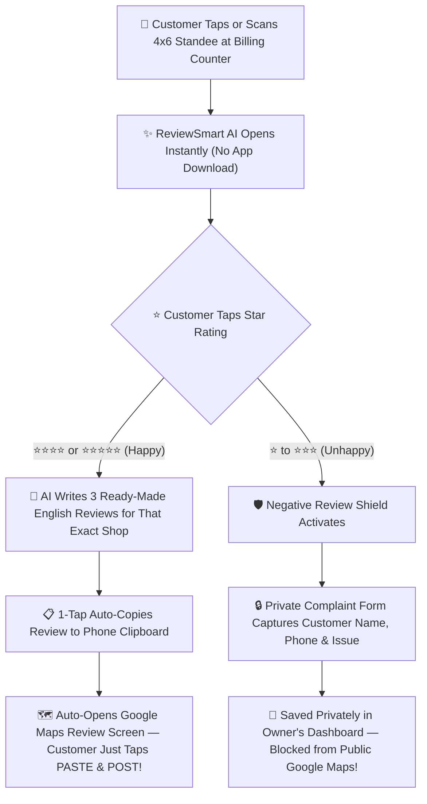

# 🚀 ReviewSmart AI — Kadapa Field Marketing Cookbook & Closer Playbook

> **Mission for Tomorrow:** Turn every local business owner in Kadapa into a **5-Star Google Maps Leader** in under **5 minutes per shop** using the **ReviewSmart AI Agent Closer POS** and the **4"×6" Smart QR + NFC Countertop Standee**.

---

## 📌 Part 1: What Are We Selling? (Explain it in 15 Seconds)

Before an agent steps into a shop in Kadapa, they must understand **why** a merchant buys ReviewSmart AI.

**We do NOT sell "software" or "plastic stands."**
We sell **New Walk-In Customers from Google Maps** and **Protection Against 1-Star Angry Reviews**.

### The 2 Problems Every Kadapa Business Owner Has Today:
1. **99% of Happy Customers Never Leave a Review:** Why? Because opening Google Maps, searching the shop name, scrolling to "Reviews", and typing 3 sentences in English is **too much work** at the billing counter.
2. **1 Angry Customer Always Leaves a 1-Star Review:** An angry customer will spend 10 minutes writing a bad review that stays on Google forever and scares away 30+ future customers.

### How ReviewSmart AI Solves Both in 10 Seconds:

---

## 🎒 Part 2: Pre-Field Checklist (Before Leaving for the Market)

Every marketing agent must verify these **6 items** before visiting their first merchant at 9:30 AM:

| # | Checklist Item | Exact Details / Action |
| :--- | :--- | :--- |
| **1** | **Smartphone Charged + Powerbank** | Minimum 90% battery + 5G mobile data active. Your phone is your **POS machine** and **Demo Kit**. |
| **2** | **Logged into Agent Closer Portal** | Open `https://reviewsmart-ai.vercel.app/login` -> Select **"User ID & PIN"** -> Log in with your `MKT-XX` code & 4-digit PIN. |
| **3** | **Hide Earnings (Privacy Toggle ON)** | On the top bar of `/agent`, make sure the **Earnings** box shows `••••` (Eye icon closed). **Never let a merchant see your 40% commission on your screen!** |
| **4** | **Live Demo Tab Open** | Keep a second browser tab ready at `https://reviewsmart-ai.vercel.app/r/momo-it-technologies` to show the 10-second live Google Maps auto-copy & paste flow. |
| **5** | **Physical Standee Stock** | Carry **5 to 8 clean 4"×6" A6 Acrylic T-Frame Standees** + printed QR cards + NFC tags in a neat folder/bag. Keep 1 sample standee in your hand when entering a shop. |
| **6** | **Google Maps App Updated** | Have Google Maps open on your phone so you can check the merchant's current star rating and review count **30 seconds before walking in**. |

---

## ⚡ Part 3: The 5-Minute "Show, Don't Tell" Sales Formula

> **Golden Rule of Field Sales in Kadapa:** Never stand at the counter giving a 10-minute lecture. Shop owners are busy. Put your phone and the Acrylic Standee **in their hands within 45 seconds**.

### Minute 1: The 30-Second Pre-Check & Entry Hook
Before walking inside the shop, search their shop name on Google Maps. Note two numbers:
- **Their Rating & Review Count** (e.g., *4.1★ with 38 reviews*)
- **A Nearby Competitor's Count** (e.g., *4.7★ with 310 reviews*)

**Walk straight to the owner (not the staff) with a warm smile:**

> **Telugu-English (Kadapa Natural Pitch):**
> *"Namaste Anna / Sir! Chinna vishayam — 30 seconds mathrame. Ippudu Kadapa lo evaraina kotha customer [Biryani / Dental Clinic / Bridal Makeup / Java Coaching] kosam Google lo search chesthe, mee shop ki kevalam 38 reviews matrame కనిపిస్తున్నాయి. Kani pakkana unna shop ki 300+ reviews unnayi. Mee daggara roju intha mandi happy customers vasthunnaru kada — vallatho 10 seconds lo typing lekunda Google 5-Star review ela veyinchalo live ga chupisthanu, okavela nacchitheనే matladudham!"*

> **English Pitch (For Doctors / Corporate / Institutes):**
> *"Good morning Sir/Madam! Quick 30-second observation — when people in Kadapa search on Google Maps for your category, your business shows only [X] reviews, even though you serve dozens of happy customers every day. The #1 reason customers don't review you is because nobody wants to type long sentences on Google. We built an AI system right here in Kadapa that lets your customer post a 5-star review in **2 taps without typing a single word**, AND blocks 1-star negative reviews from going public. Watch this on your own shop name in 10 seconds!"*

---

### Minute 2: The "Aha!" Moment Using the Agent Closer App
Don't show a generic brochure. Open your **Agent Closer (`/agent`)** tab and type their shop name right in front of them!

1. **Show the Live 4"×6" Standee Preview:**
   - The moment you select their business in Step 1 of `/agent`, the app renders a **3D Countertop Standee with THEIR exact shop name and address**.
   - **Say:** *"Chudandi Sir, mee billing counter paina ee standee ela untundo! 'Tap or Scan to Review [Their Shop Name]'."*
2. **Show the Live AI Review Pitch Demo (Inside `/agent`):**
   - Tap the **5th Star (5★)** right on the Agent Closer screen.
   - In 2 seconds, the AI writes **3 authentic English reviews** specifically mentioning their shop name and category!
   - **Say:** *"Customer ki English radhu anna parledhu, time lekapoina parledhu. Customer 5-Star nokkagane, AI automatic ga 3 super reviews rasthundi. Okka tap chesthe automatic ga copy ayyi direct Google Maps review page open avthundi — customer just 'Paste' nokkithe chalu!"*
3. **Show the 1-3 Star "Negative Review Shield":**
   - Now tap **2 Stars (2★)** on the demo screen.
   - Show them how the screen changes to a **Private Owner Feedback Box** instead of going to Google!
   - **Say:** *"Idi chala important Sir! Evadaina kopam tho 1-star leda 2-star kodithe, adi Google loki velladhu! Direct ga mee private dashboard loki complaint laaga vasthundi. Mee Google rating eppudu 4.8★–5.0★ ga safe ga untundi."*

---

## 📱 Part 4: Step-by-Step Guide to Using the Agent Closer (`/agent`)

Every agent must follow this exact workflow inside the **Agent Closer POS** so that the merchant's Google Review link works 100% seamlessly on both **Android and iPhone**.

### 🔍 Step 1: Search Business (CRITICAL PRO-TIP FOR 100% ACCURACY)
Inside **Step 1 ("Search Merchant's Google Business")**:
- **Method A (Fastest):** Type the merchant's business name + `"Kadapa"` (e.g., `Vijaya Yummy Foods Kadapa`) and tap **Search**. Select their card from the results.
- **Method B (100% Bulletproof — Best for Newly Listed or Tricky Shops):**
  - If a shop has a common name or doesn't show up first, ask the merchant: *"Sir, mee Google Maps lo Share link copy chesi ivvandi."* (Or search their shop on your Google Maps app -> Tap **Share** -> **Copy Link**).
  - Paste the `https://maps.app.goo.gl/...` or `https://share.google/...` link directly into the **Search box** (or into the **Step 2 Google Review Link override box**).
  - Our system automatically extracts the official Google Place ID so every customer lands directly inside the **Google "Write a Review" composer screen**!

### 🔐 Step 2: Merchant Mobile & 4-Digit Random PIN
- Enter the merchant's **10-digit WhatsApp mobile number** (e.g., `9876543210`).
  - Tell the merchant: *"Sir, mee mobile number eh mee User ID."*
- A **4-digit PIN** is already generated automatically. Leave it as-is (or tap `Roll New` if they want another number).

### 💰 Step 3: Agreed Negotiated Amount & Dynamic UPI QR
- Select one of the quick buttons (`₹999`, `₹1,499`, `₹1,999`, `₹2,499`) or type the exact agreed price (minimum `₹499`).
- Tap the green button: **"Generate Dynamic UPI QR & Close Deal"**.
- **What happens immediately:**
  1. The merchant's account and live AI Review Card (`/r/their-shop-name`) are created in real time!
  2. A **Dynamic UPI QR Code** (`momopedeals@oksbi` — **Damerla Mohan**) pops up on your phone with the **exact rupee amount pre-locked** (the merchant doesn't even have to type the amount in PhonePe / GPay / Paytm).

### 🤝 Step 4: Payment, WhatsApp Handover & Physical Standee Setup
1. Have the merchant scan the **Dynamic UPI QR** on your screen and complete the payment.
2. Scroll down to the green **"Share Credentials via WhatsApp to Merchant"** button and tap it.
   - It automatically opens WhatsApp to the merchant's number with a formatted welcome message containing:
     - Their **Live AI Review Card URL** (`https://reviewsmart-ai.vercel.app/r/...`)
     - Their **Dashboard Login URL**, **User ID (Mobile Number)**, and **4-Digit PIN**.
3. **Print / Insert the QR Card** into the **4"×6" Acrylic Standee** (or link their NFC tag), place it right next to their PhonePe/Paytm payment QR at the billing counter, and **do 1 live scan on the merchant's own phone** before leaving!

---

## 🏙️ Part 5: Kadapa Market Territory & Industry Pitch Cheat Sheet

### 1. 🏥 Doctors, Dental Clinics, Eye Hospitals & Diagnostics
- **Prime Kadapa Zones:** *Yerramukkapalli, Christian Lane, RIMS Road, ITI Circle, Nagarajupeta*
- **Winning Pitch Line:**
  > *"Doctor garu, mee daggara treatment teskoni happy ga velle patients 100 mandi unte, andulo okkaru kuda Google lo review rayaru. Kani reception daggara 15 minutes wait chesina okka patient matram kopam tho 1-star vestadu. Ee Smart Standee reception daggara pedithe, happy patients 2 taps lo 'Best Doctor in Kadapa' ani AI review post chestaru, and evaraina waiting time gurinchi 1-star kodithe adi Google loki vellakunda direct ga mee private inbox ki vasthundi."*
- **Recommended Price to Quote:** **₹1,999 → Close at ₹1,499**.

### 2. 🍛 Restaurants, Biryani Points, Cafes, Bakeries & Tiffin Centers
- **Prime Kadapa Zones:** *Seven Roads Circle, RTC Bus Stand Road, Madras Road, Almaspet, NGO Colony*
- **Winning Pitch Line:**
  > *"Anna, customer biryani thini cash counter daggara PhonePe scan chestadu. Appude pakkana ee Acrylic Standee unte, 'Scan & Tap 5 Stars' ani chepthe chalu — 10 seconds lo 'Best Biryani & Fast Service in Kadapa' ani pedda review Google lo padipothundi. Roju 15 reviews vachina, okka nelalo 450+ 5-star reviews tho Kadapa lo #1 top lo mee hotel vasthundi!"*
- **Recommended Price to Quote:** **₹1,499 → Close at ₹999**.

### 3. 🎓 Training Institutes, Coaching Centers, Computer & Spoken English Academies
- **Prime Kadapa Zones:** *Seven Roads Circle, Dwaraka Nagar, Sankarapuram, RTC Bus Stand Area*
- **Winning Pitch Line:**
  > *"Sir, students join ayye mundu pakka Google reviews chustaru. Kani manam students ni review ivvamante 'Good institute' ani 2 words matrame pedatharu. Maa AI system tho student okka tap chesthe, mee coaching, faculty, practical lab gurinchi 3–4 lines professional English review automatic ga copy ayyi Google lo post avthundi. Chudandi MOMO IT Technologies vallaki ela panichesthundo!"*
- **Recommended Price to Quote:** **₹1,999 → Close at ₹1,499 or ₹999**.

### 4. 💇‍♀️ Beauty Parlours, Unisex Salons, Bridal Studios & Boutiques
- **Prime Kadapa Zones:** *Yerramukkapalli, Seven Roads, Prakash Nagar, Co-operative Colony*
- **Winning Pitch Line:**
  > *"Madam / Bro, haircut leda facial ayyaka customer mirror lo chuskoni chala happy ga untaru. Aa time lo counter daggara ee luxury Acrylic Standee unte, ఒక్క tap tho 5-star review vestaru. Okka bridal customer Google Maps nundi vachina meeku ₹10,000+ business vasthundi, kani deeni price kevalam ₹999 mathrame!"*
- **Recommended Price to Quote:** **₹1,499 → Close at ₹999**.

### 5. 💍 Jewellery, Opticals, Mobile Showrooms, Car/Bike Accessories & Hotels
- **Prime Kadapa Zones:** *Bazar Street, Trunk Road, Madras Road, Railway Station Road*
- **Recommended Price to Quote:** **₹1,999 → Close at ₹1,499 or ₹999**.

---

## 💵 Part 6: Pricing Psychology, Negotiation Ladder & Your 40% Commission Math

### The 4-Step Negotiation Ladder

| Step | What You Quote / Do | When to Use It |
| :--- | :--- | :--- |
| **1. The Anchor (₹1,999)** | *"Sir, regular online price with the 4×6 Acrylic Standee, NFC Tag, Lifetime AI Review Engine & Negative Review Shield is **₹1,999**."* | Say this first to **every single merchant**. |
| **2. The Kadapa Launch Offer (₹1,499)** | *"Since our team is doing the direct Kadapa market launch on this road today, we are giving the complete setup + physical standee at **₹1,499**."* | Default selected button in your `/agent` app. Great closing price for clinics, showrooms, and institutes. |
| **3. The Sweet-Spot Instant Close (₹999)** | *"Sir, meeru ippude spot lo activate chesukunte, nenu నా agent special discount కింద **₹999** ki full setup + standee icchesthanu. No monthly headache!"* | Closes **80% of restaurants, salons, and retail shops** immediately. |
| **4. The Last-Resort Walkaway Floor (₹699 – ₹499)** | *"Anna, kevalam Acrylic Standee + NFC + AI setup cost kosam last **₹699 / ₹499** cheyagalanu — kani మీరు మీ ప్రక్క షాప్ వాళ్ళకి ₹999 అనే చెప్పాలి!"* | **Emergency floor only** for small tiffin centers/petty shops, or when closing 2–3 shops together in the same complex. |

### 🤑 Agent Earnings Calculator (You Earn 40% on Every Verified Sale!)

| Daily Target | Average Deal Price | Total Daily Sales | **Your Daily Commission (40%)** | **Your Monthly Income (26 Working Days)** |
| :--- | :---: | :---: | :---: | :---: |
| **2 Deals / Day** (Beginner) | ₹999 | ₹1,998 | **₹800 / day** | **₹20,800 / month** |
| **3 Deals / Day** (Standard) | ₹1,199 | ₹3,597 | **₹1,438 / day** | **₹37,400 / month** |
| **5 Deals / Day** (Star Closer) | ₹1,199 | ₹5,995 | **₹2,398 / day** | **₹62,348 / month** |
| **5 Deals / Day** (Pro Anchor) | ₹1,499 | ₹7,495 | **₹2,998 / day** | **₹77,948 / month** |

---

## 🛡️ Part 7: The Top 8 Merchant Objections & Word-for-Word Rebuttals

1. **"Maaku already chala mandi regular customers unnaru, Google avasaram ledhu."**
   - *"Correct anna! Patha customers tho meeru ee standee dwara reviews veyisthe, aa reviews chusi Kadapa loki vache **kotha customers** mee shop ki vastharu!"*
2. **"Memu already normal Google QR code print teesi pettamu."**
   - *"Normal Google QR scan chesthe khali box vasthundi — customer type chese opika leka back nokkestaru. Maa AI QR scan chesthe **review kuda AI ne rasi automatic ga copy chesthundi** — customer just Paste nokkithe chalu! Plus maa dantlo 1-star block avthundi."*
3. **"Repu raa / Next week chuddam."**
   - *"Sir, idi ₹50,000 software kadhu alochinchadaniki — kevalam ₹999. Okka kotha customer Google chusi vachina mee ₹999 ఈరోజే తిరిగి వచ్చేస్తుంది. 2 minutes lo mee phone lone live chesi pedathanu!"*
4. **"₹999 ekkuva anna, ₹300 ki isthava?"**
   - *"Anna, kevalam ee imported 4×6 Acrylic Standee + NFC chip + Google AI server cost eh chala avthundi. Mee kosam final ga ₹799 / ₹699 chesthanu, ippude counter meeda set cheseddam!"*
5. **"iPhone lo work avthunda? Android lo work avthunda?"**
   - *"100% rendu phones lonu super fast ga work avthundi Sir! Ippude mee phone lone okasari test cheyandi!"*
6. **"AI rasina reviews anni oke laaga untaya? Google block chesthunda?"**
   - *"Assalu oke laaga undavu Sir! Prathi sari AI kotha words tho natural ga rasthundi. 100% genuine Google policy prakaram untundi."*
7. **"Owner ippudu shop lo leru, evening vastharu."**
   - *"Nenu ippude mee shop peru meeda Digital Standee preview create chesi pettanu — owner gari WhatsApp number ivvandi, preview pampinchi evening exact time ki vachi kalusthanu."*
8. **"Naaku phone వాడటం పెద్దగా రాదు."**
   - *"Sir, meeru roju ఏమీ చేయాల్సిన అవసరమే లేదు! Nenu ippude అన్నీ సెట్ చేసి ఈ Standee మీ కౌంటర్ మీద పెడతాను. Customers స్కాన్ చేసుకుంటారు, ఆటోమేటిక్ గా మీ గూగుల్ రివ్యూలు పెరిగిపోతాయి."*
