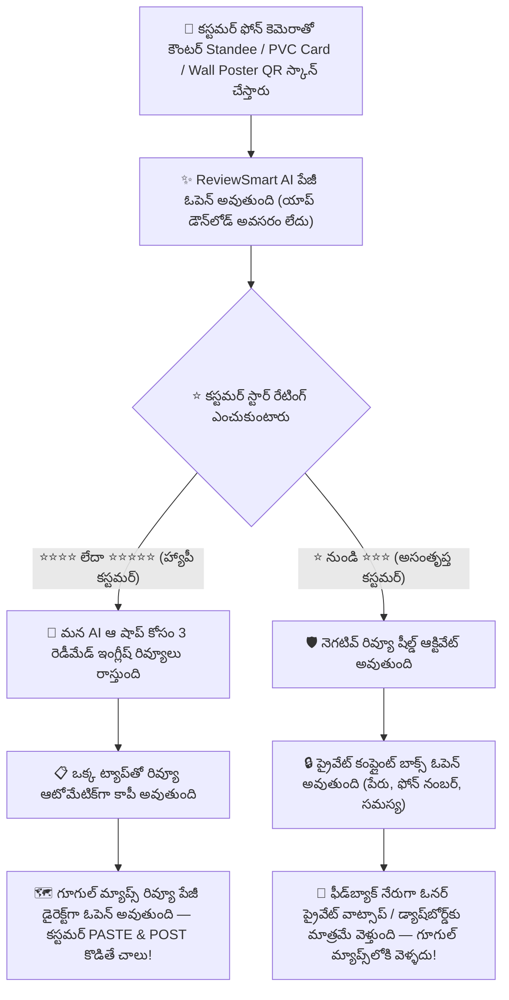

# 🚀 ReviewSmart AI — Kadapa Field Marketing Cookbook & Closer Playbook
> **కడప మార్కెటింగ్ ఏజెంట్ ఫీల్డ్ గైడ్ & సేల్స్ హ్యాండ్‌బుక్**
>
> **మన లక్ష్యం (Our Mission):** కడపలోని ప్రతి వ్యాపారిని (Doctor, Hotel, Clothing Store, Salon, Coaching Center) కేవలం **5 నిమిషాల్లో** గూగుల్ మ్యాప్స్ లీడర్‌గా మార్చడం!
> **లైవ్ డొమైన్ (Official Platform):** [https://reviewsmart.online](https://reviewsmart.online)

---

## 📌 Part 1: మనం ఏమి అమ్ముతున్నాం? (What Are We Selling?)

మనం కేవలం "సాఫ్ట్‌వేర్" లేదా "ప్లాస్టిక్ స్టాండ్" అమ్మడం లేదు.
మనం అమ్ముతున్నది:
1. **గూగుల్ మ్యాప్స్ ద్వారా కొత్త కస్టమర్లు (More Walk-in Customers)**
2. **నెగటివ్ రివ్యూల నుండి రక్షణ (Negative Review Shield to Protect Reputation)**

### కడపలోని ప్రతి వ్యాపారి ఎదుర్కొనే 2 పెద్ద సమస్యలు:
1. **99% మంచి కస్టమర్లు రివ్యూ రాయరు:** ఎందుకంటే కౌంటర్ దగ్గర నిలబడి గూగుల్ మ్యాప్స్ ఓపెన్ చేసి, షాప్ పేరు వెతికి, 3 లైన్లు ఇంగ్లీషులో టైప్ చేయడం ఎవరికీ ఇష్టం ఉండదు.
2. **ఒక్క అసంతృప్త కస్టమర్ అయినా 1-స్టార్ రివ్యూ ఇచ్చేస్తాడు:** కోపంలో ఉన్న కస్టమర్ 10 నిమిషాలు కేటాయించి బ్యాడ్ రివ్యూ రాస్తాడు. అది గూగుల్‌లో శాశ్వతంగా ఉండి, భవిష్యత్తులో వచ్చే 50 మంది కస్టమర్లను దూరం చేస్తుంది.

### ReviewSmart AI దీన్ని ఎలా పరిష్కరిస్తుంది?

```mermaid
flowchart TD
    A["📱 కస్టమర్ ఫోన్ కెమెరాతో కౌంటర్ Standee / PVC Card / Wall Poster QR స్కాన్ చేస్తారు"] --> B["✨ ReviewSmart AI పేజీ ఓపెన్ అవుతుంది (యాప్ డౌన్‌లోడ్ అవసరం లేదు)"]
    B --> C{"⭐ కస్టమర్ స్టార్ రేటింగ్ ఎంచుకుంటారు"}
    
    C -->|"⭐⭐⭐⭐ లేదా ⭐⭐⭐⭐⭐ (హ్యాపీ కస్టమర్)"| D["🤖 మన AI ఆ షాప్ కోసం 3 రెడీమేడ్ ఇంగ్లీష్ రివ్యూలు రాస్తుంది"]
    D --> E["📋 ఒక్క ట్యాప్‌తో రివ్యూ ఆటోమేటిక్‌గా కాపీ అవుతుంది"]
    E --> F["🗺️ గూగుల్ మ్యాప్స్ రివ్యూ పేజీ డైరెక్ట్‌గా ఓపెన్ అవుతుంది — కస్టమర్ PASTE & POST కొడితే చాలు!"]
    
    C -->|"⭐ నుండి ⭐⭐⭐ (అసంతృప్త కస్టమర్)"| G["🛡️ నెగటివ్ రివ్యూ షీల్డ్ ఆక్టివేట్ అవుతుంది"]
    G --> H["🔒 ప్రైవేట్ కంప్లైంట్ బాక్స్ ఓపెన్ అవుతుంది (పేరు, ఫోన్ నంబర్, సమస్య)"]
    I["📩 ఫీడ్‌బ్యాక్ నేరుగా ఓనర్ ప్రైవేట్ వాట్సాప్ / డ్యాష్‌బోర్డ్‌కు మాత్రమే వెళ్తుంది — గూగుల్ మ్యాప్స్‌లోకి వెళ్ళదు!"]
    H --> I
```

---

## 📦 Part 2: 3 రకాల ప్రీమియం డిస్‌ప్లే ఫార్మాట్లు (Physical Display Formats)

మనం NFC వాడటం లేదు (No NFC). కేవలం హై-రిజల్యూషన్ స్మార్ట్ QR కోడ్ ద్వారా ఏదైనా స్మార్ట్‌ఫోన్ కెమెరాతో 100% వేగంగా పనిచేస్తుంది!

| # | డిస్‌ప్లే ఫార్మాట్ | సైజు (Size) | ఎక్కడ వాడాలి? (Best Placement) |
| :--- | :--- | :--- | :--- |
| **1** | **4"×6" (A6) అక్రిలిక్ కౌంటర్ స్టాండీ** (Acrylic Counter Standee) | 4 × 6 అంగుళాలు (Portrait) | బిల్లింగ్ కౌంటర్, రిసెప్షన్ డెస్క్, క్యాష్ కౌంటర్ దగ్గర PhonePe/GPay QR పక్కన. |
| **2** | **వర్టికల్ PVC కార్డ్** (Vertical PVC Card - PAN Size) | 54mm × 85.6mm (CR80) | టేబుల్స్ మీద, చిన్న క్యాష్ డెస్క్‌ల మీద, లేదా డెలివరీ పాకెట్స్‌లో. వాటర్‌ప్రూఫ్, చాలా స్టైలిష్. |
| **3** | **A4 వాల్ & డోర్ ప్రింటబుల్ పోస్టర్** (A4 Wall & Door Poster) | 210mm × 297mm | షాప్ ఎంట్రన్స్ గ్లాస్ డోర్, వెయిటింగ్ హాల్ గోడ, ట్రయల్ రూమ్ దగ్గర ఫ్రేమ్ కట్టి లేదా లామినేట్ చేసి అతికించడానికి. |

> **ఫ్లెక్సిబుల్ లోగో సిస్టమ్ (Adaptive Logo):** వ్యాపారి లోగో స్క్వేర్ అయినా, రౌండ్ అయినా, లేదా వైడ్ బ్యానర్ అయినా సరే... కట్ అవ్వకుండా చాలా అందంగా అమరుతుంది!

### 🌟 3 సూపర్ పవర్స్ (కడప మార్కెట్లో మన ప్రత్యేకతలు):
1. **ఆల్-ఇన్-వన్ స్మార్ట్ హబ్ (Counter Clutter Buster):**  
   కౌంటర్ మీద 4 బోర్డులు (PhonePe QR, WhatsApp ఆర్డర్ QR, మెనూ కార్డ్, గూగుల్ రివ్యూ బోర్డ్) పెట్టాల్సిన గజిబిజి లేదు! ఈ ఒక్క స్టాండీ/కార్డుతో:
   - ⭐ గూగుల్ 5-స్టార్ రివ్యూ (Gemini AI సహాయంతో 10 సెకన్లలో)
   - 💬 వాట్సాప్ డైరెక్ట్ చాట్ & ఆర్డర్స్
   - 📋 డిజిటల్ మెనూ / ప్రొడక్ట్ కేటలాగ్
   - 💳 డైరెక్ట్ UPI పేమెంట్ (0% ఫీజుతో నేరుగా ఓనర్ ఖాతాకే)
2. **జీరో-రీప్రింట్ గ్యారెంటీ (Zero-Reprint Dynamic QR):**  
   రేపు వ్యాపారి ఫోన్ నెంబర్ మారినా, షాప్ మారినా, మెనూ లేదా గూగుల్ లింక్ మారినా... కౌంటర్ స్టాండీని మళ్లీ రీప్రింట్ చేయాల్సిన పనిలేదు! డాష్‌బోర్డ్ నుంచి 1 సెకనులో ఆటోమేటిక్‌గా అప్‌డేట్ అవుతుంది.
3. **100% నో-యాడ్స్ గ్యారెంటీ (Zero Ads & Zero Spam):**  
   ఆన్‌లైన్‌లో ఫ్రీగా లేదా ₹99 కి దొరికే చీప్ QR కోడ్లలాగా కస్టమర్ మొబైల్‌లో థర్డ్-పార్టీ చెత్త యాడ్స్, స్పామ్ లింకులు రావు. 100% స్వచ్ఛమైన, సూపర్ ఫాస్ట్ లగ్జరీ అనుభవం!

---

## 🎒 Part 3: మార్కెట్‌లోకి వెళ్ళే ముందు చెక్‌లిస్ట్ (Pre-Field Checklist)

ప్రతి మార్కెటింగ్ ఏజెంట్ ఉదయం 9:30 గంటలకల్లా ఈ 6 విషయాలు సరిచూసుకోవాలి:

| # | చెక్‌లిస్ట్ అంశం | ఏమి చేయాలి? |
| :--- | :--- | :--- |
| **1** | **స్మార్ట్‌ఫోన్ ఛార్జింగ్ + నెట్** | కనీసం 90% బ్యాటరీ + 5G డేటా. మీ ఫోనే మీ POS మెషిన్ మరియు లైవ్ డెమో కిట్. |
| **2** | **ఏజెంట్ పోర్టల్ లాగిన్** | `https://reviewsmart.online/login` ఓపెన్ చేసి మీ మొబైల్ నంబర్ & 4-అంకెల PIN తో లాగిన్ అవ్వండి. |
| **3** | **కమిషన్ హైడ్ చేయండి (Privacy ON)** | `/agent` స్క్రీన్ పైన **Earnings** బాక్స్‌లో కంటి గుర్తు నొక్కి `••••` ఉండేలా చూసుకోండి. మీ 40% కమిషన్ వ్యాపారికి కనిపించకూడదు! |
| **4** | **లైవ్ డెమో ట్యాబ్ సిద్ధంగా ఉంచండి** | `https://reviewsmart.online/r/sri-guru-fashions-kadapa` లేదా `https://reviewsmart.online/r/momo-it-technologies` లింక్ ఓపెన్ చేసి ఉంచండి. |
| **5** | **శాంపిల్ అక్రిలిక్ స్టాండీ & PVC కార్డ్** | మీ చేతిలో ఎప్పుడూ ఒక అందమైన శాంపిల్ స్టాండీ మరియు వర్టికల్ PVC కార్డ్ ఉండాలి. |
| **6** | **గూగుల్ మ్యాప్స్ చెక్** | షాపులోకి అడుగుపెట్టే 30 సెకన్ల ముందే వాళ్ళ గూగుల్ రేటింగ్ మరియు రివ్యూల సంఖ్య చూసుకోండి. |

---

## ⚡ Part 4: 5 నిమిషాల సేల్స్ ఫార్ములా (The 5-Minute "Show, Don't Tell" Pitch)

> **గోల్డెన్ రూల్:** కౌంటర్ దగ్గర నిలబడి ఎక్కువసేపు లెక్చర్లు ఇవ్వకండి. 45 సెకన్లలోనే మీ చేతిలోని శాంపిల్ స్టాండీని ఓనర్ చేతిలో పెట్టండి!

### నిమిషం 1: 30 సెకన్ల ఎంట్రీ హుక్ (Walk Straight to the Owner)

షాపులోకి వెళ్లి చిరునవ్వుతో ఓనర్‌ను మాత్రమే కలవండి:

#### 🗣️ తెలుగులో చెప్పాల్సిన మాటలు (Natural Telugu Script):
> *"నమస్తే అన్నా / సార్! ఒక్క 30 సెకన్లు నా మాట వినండి.*  
> *ఇప్పుడు కడపలో ఎవరైనా కొత్త కస్టమర్ మీ కేటగిరీ కోసం గూగుల్‌లో వెతికినప్పుడు, మీ షాపుకి కేవలం [30] రివ్యూలు మాత్రమే ఉన్నాయి. కానీ మీ కాంపిటీటర్ షాపుకి 300 రివ్యూలు ఉన్నాయి.*  
> *మీ దగ్గరికి రోజూ వందలాది మంది హ్యాపీ కస్టమర్లు వస్తున్నారు కదా... వాళ్ళతో టైపింగ్ అవసరం లేకుండా, కేవలం 10 సెకన్లలో 5-స్టార్ గూగుల్ రివ్యూ ఎలా వేయించవచ్చో మీ షాప్ పేరుతోనే లైవ్‌గా చూపిస్తాను. నచ్చితేనే మాట్లాడదాం సార్!"*

---

### నిమిషం 2: ఏజెంట్ క్లోజర్ యాప్‌లో "Aha!" మూమెంట్

1. మీ ఫోన్‌లో `/agent` ఓపెన్ చేసి వాళ్ళ షాప్ పేరు టైప్ చేయండి (ఉదా: `Sri Guru Fashions Kadapa`).
2. వాళ్ళ షాప్ కార్డు సెలెక్ట్ చేయగానే, వాళ్ళ సొంత షాప్ పేరు మరియు లోగోతో 3D స్టాండీ ప్రివ్యూ కనిపిస్తుంది!
   - 🗣️ **వ్యాపారితో చెప్పండి:**  
     *"చూడండి సార్! మీ బిల్లింగ్ కౌంటర్ మీద మీ షాప్ పేరుతో ఈ గోల్డెన్ స్టాండీ ఉంటే ఎంత రాయల్ లుక్ వస్తుందో!"*
3. **5-స్టార్ AI రివ్యూ డెమో చూపించండి:**
   - స్క్రీన్ మీద **5★** నొక్కండి. క్షణాల్లో AI ఆ షాప్ పేరుతో 3 అద్భుతమైన ఇంగ్లీష్ రివ్యూలు రాస్తుంది.
   - 🗣️ **వ్యాపారితో చెప్పండి:**  
     *"కస్టమర్‌కి ఇంగ్లీష్ రాకపోయినా, టైప్ చేసే టైమ్ లేకపోయినా పర్లేదు సార్! 5-స్టార్ ట్యాప్ చేయగానే AI సూపర్ రివ్యూ రాస్తుంది. ఒక్క ట్యాప్‌తో కాపీ అయి గూగుల్ మ్యాప్స్ ఓపెన్ అవుతుంది. కస్టమర్ జస్ట్ 'Paste & Post' కొడితే చాలు!"*
4. **నెగటివ్ రివ్యూ షీల్డ్ చూపించండి (The Biggest Closer!):**
   - ఇప్పుడు **2★** లేదా **1★** నొక్కండి. వెంటనే గూగుల్ ఓపెన్ అవ్వకుండా ప్రైవేట్ కంప్లైంట్ బాక్స్ వస్తుంది!
   - 🗣️ **వ్యాపారితో చెప్పండి:**  
     *"ఇది మన సిస్టమ్ యొక్క అతిపెద్ద పవర్ సార్! ఎవరైనా కస్టమర్ కోపంలో 1-స్టార్ లేదా 2-స్టార్ ఇస్తే, అది గూగుల్‌లోకి వెళ్ళదు! నేరుగా మీ వాట్సాప్‌కు మాత్రమే ప్రైవేట్‌గా వస్తుంది. మీ గూగుల్ రేటింగ్ ఎప్పటికీ 4.8★ పైన సేఫ్‌గా ఉంటుంది!"*

---

### 🎁 సీక్రెట్ వెపన్: 24 గంటల ఉచిత లైవ్ ట్రయల్ (1-Day Free Live Trial)

ఒకవేళ వ్యాపారి *"కస్టమర్లు స్కాన్ చేస్తారో లేదో నాకు నమ్మకం లేదు"* లేదా *"రేపు రా"* అని వెనకాడుతుంటే... వెంటనే ఈ బ్రహ్మాస్త్రాన్ని ప్రయోగించండి:

#### 🗣️ తెలుగులో చెప్పాల్సిన మాటలు:
> *"సార్! మీరు ఒక్క రూపాయి కూడా ఇప్పుడే కట్టవద్దు.*  
> *మీ షాపుకి ఈరోజే **24 గంటల ఫ్రీ లైవ్ ట్రయల్** ఆక్టివేట్ చేసి ఈ శాంపిల్ మీ కౌంటర్ మీద పెడతాను.*  
> *ఈరోజు వచ్చే కస్టమర్లతో స్కాన్ చేయించండి. మీ కళ్లముందే గూగుల్‌లో రివ్యూలు పడటం చూడండి.*  
> *రేపు సాయంత్రం వచ్చి కలుస్తాను. మీకు నిజంగా నచ్చి ఉపయోగపడింది అనుకుంటేనే పేమెంట్ చేయండి, లేదంటే ఆగిపోతుంది. మీకు నష్టమేమీ లేదు కదా సార్!"*

👉 ఏజెంట్ పోర్టల్‌లో ఆ షాప్ మేనేజ్‌మెంట్ పేజీకి వెళ్లి **"Activate 24h Live Demo"** బటన్ నొక్కగానే ఆ షాప్ లైవ్ అయిపోతుంది! వాటర్ మార్క్ పోతుంది, కస్టమర్లు నిజంగానే రివ్యూలు ఇవ్వగలరు!

---

## 📱 Part 5: ఏజెంట్ క్లోజర్ POS వాడే విధానం (`/agent`)

### స్టెప్ 1: గూగుల్ ప్రొఫైల్ సెర్చ్ (Search Merchant Profile)
- షాప్ పేరు + `"Kadapa"` అని టైప్ చేయండి (ఉదా: `Kadapa Clothing Store`).
- ఒకవేళ షాప్ పేరు లిస్ట్‌లో కనిపించకపోతే, వ్యాపారిని వాళ్ళ గూగుల్ మ్యాప్స్ షేర్ లింక్ అడగండి (Share ➔ Copy Link). ఆ లింక్ పేస్ట్ చేస్తే చాలు, సిస్టమ్ ఆటోమేటిక్‌గా గూగుల్ ప్లేస్ ఐడీని తీసుకుంటుంది.

### స్టెప్ 2: మొబైల్ నంబర్ & 4-అంకెల పిన్ (Mobile & PIN)
- వ్యాపారి 10-అంకెల వాట్సాప్ మొబైల్ నంబర్ ఎంటర్ చేయండి.
- 🗣️ *"సార్, మీ మొబైల్ నంబరే మీ యూజర్ ఐడీ. ఈ 4 అంకెల పిన్ మీ పాస్‌వర్డ్."*

### స్టెప్ 3: ధర నిర్ణయం & డైనమిక్ UPI QR కోడ్
- ఒప్పందం కుదిరిన రేటును ఎంచుకోండి (`₹1,999`, `₹2,499`, `₹2,999`, లేదా `₹3,999`).
- **"Generate Dynamic UPI QR & Close Deal"** బటన్ నొక్కండి.
- మీ స్క్రీన్ మీద డైనమిక్ UPI QR కోడ్ కనిపిస్తుంది (ఖచ్చితమైన రూపీ అమౌంట్‌తో). వ్యాపారి PhonePe / GPay తో స్కాన్ చేసి పేమెంట్ పూర్తి చేస్తారు.

### స్టెప్ 4: 1-క్లిక్ వాట్సాప్ హ్యాండోవర్ (Instant WhatsApp Dispatch)
- ఆకుపచ్చని **"Share Credentials via WhatsApp"** బటన్ నొక్కండి.
- వ్యాపారి వాట్సాప్‌కి వారి లాగిన్ వివరాలు, లైవ్ రివ్యూ లింక్ (`https://reviewsmart.online/r/their-slug`) వెళ్ళిపోతాయి.
- కౌంటర్ మీద స్టాండీ/కార్డ్ పెట్టి, వ్యాపారి ఫోన్‌తోనే ఒక్కసారి టెస్ట్ స్కాన్ చేసి చూపించి షేక్‌హ్యాండ్ ఇవ్వండి!

---

## 🏙️ Part 6: కడప మార్కెట్ కేటగిరీలు & పిచ్ డైలాగులు (Category-Wise Telugu Pitches)

### 1. 🏥 డాక్టర్లు, డెంటల్ క్లినిక్‌లు, హాస్పిటల్స్ & ల్యాబ్‌లు
- **కడప ప్రధాన ఏరియాలు:** *ఎర్రముక్కపల్లి, క్రిస్టియన్ లేన్, రిమ్స్ రోడ్, ఐటిఐ సర్కిల్, నాగరాజుపేట*
- **🗣️ తెలుగు పిచ్:**
  > *"డాక్టర్ గారూ, మీ దగ్గర ట్రీట్‌మెంట్ తీసుకుని హ్యాపీగా వెళ్ళే పేషెంట్లు వందమంది ఉంటే, అందులో ఒక్కరూ కూడా గూగుల్‌లో రివ్యూ రాయరు.*  
  > *కానీ రిసెప్షన్ దగ్గర 15 నిమిషాలు వెయిట్ చేసిన ఒక్క పేషెంట్ మాత్రం కోపంతో 1-స్టార్ రేటింగ్ వేస్తాడు.*  
  > *ఈ స్మార్ట్ స్టాండీని రిసెప్షన్ దగ్గర పెడితే, హ్యాపీ పేషెంట్లు 10 సెకన్లలో 'Best Doctor in Kadapa' అని AI రివ్యూ రాస్తారు. ఏదైనా కంప్లైంట్ ఉంటే గూగుల్‌లోకి వెళ్ళకుండా ప్రైవేట్‌గా మీ వాట్సాప్‌కు వస్తుంది."*
- **రేటు:** **₹2,999 చెప్పి ➔ ₹2,499 లేదా ₹1,999 కి క్లోజ్ చేయండి.**

---

### 2. 🍛 రెస్టారెంట్లు, బిర్యానీ పాయింట్లు, కేఫ్‌లు & బేకరీలు
- **కడప ప్రధాన ఏరియాలు:** *సెవెన్ రోడ్స్ సర్కిల్, ఆర్టీసీ బస్టాండ్ రోడ్, మద్రాస్ రోడ్, అల్మాస్‌పేట్, ఎన్జీవో కాలనీ*
- **🗣️ తెలుగు పిచ్:**
  > *"అన్నా, కస్టమర్ బిర్యానీ తిన్నాక క్యాష్ కౌంటర్ దగ్గర PhonePe స్కాన్ చేస్తాడు కదా.*  
  > *దాని పక్కనే ఈ స్టాండీ పెట్టి 'అన్నా, ఒక్క 5-స్టార్ రేటింగ్ వేయండి' అంటే చాలు — 10 సెకన్లలో 'Best Biryani in Kadapa' అని పెద్ద రివ్యూ గూగుల్‌లో పడిపోతుంది.*  
  > *నెలకు 300 కొత్త 5-స్టార్ రివ్యూలు వస్తే, కడపలో ఫుడ్ కోసం గూగుల్‌లో వెతికే ప్రతి కస్టమర్ మీ హోటల్‌కే వస్తాడు!"*
- **రేటు:** **₹2,499 చెప్పి ➔ ₹1,999 కి క్లోజ్ చేయండి.**

---

### 3. 👗 బట్టల దుకాణాలు, శారీ సెంటర్లు & జ్యువెలరీ షాపులు
- **కడప ప్రధాన ఏరియాలు:** *బజార్ స్ట్రీట్, ట్రంక్ రోడ్, ఆర్ట్స్ కాలేజ్ రోడ్, ద్వారకా నగర్*
- **🗣️ తెలుగు పిచ్:**
  > *"సార్, పెళ్ళిళ్ళ సీజన్‌లో కస్టమర్లు బట్టలు లేదా నగల కోసం ముందుగా గూగుల్ రివ్యూలు చూసే వస్తారు.*  
  > *శ్రీ గురు ఫ్యాషన్స్ లాంటి పెద్ద బ్రాండ్లే కౌంటర్ మీద మన రివ్యూస్మార్ట్ వాడుతున్నారు.*  
  > *కస్టమర్ బిల్ కట్టే సమయంలో వాళ్ళ కెమెరాతో స్కాన్ చేయిస్తే చాలు, 'Exclusive Menswear & Best Collection in Kadapa' అని AI రివ్యూ పోస్ట్ అవుతుంది!"*
- **రేటు:** **₹2,999 చెప్పి ➔ ₹2,499 లేదా ₹1,999 కి క్లోజ్ చేయండి.**

---

### 4. 💇‍♀️ బ్యూటీ పార్లర్లు, సెలూన్లు & బ్రైడల్ స్టూడియోలు
- **కడప ప్రధాన ఏరియాలు:** *ఎర్రముక్కపల్లి, సెవెన్ రోడ్స్, ప్రకాష్ నగర్, కో-ఆపరేటివ్ కాలనీ*
- **🗣️ తెలుగు పిచ్:**
  > *"మేడమ్ / బ్రో, హెయిర్‌కట్ లేదా బ్రైడల్ మేకప్ అయ్యాక కస్టమర్ అద్దంలో చూసుకుని చాలా సంతోషంగా ఉంటారు.*  
  > *ఆ మూమెంట్‌లో ఈ వర్టికల్ కార్డ్ లేదా స్టాండీ చూపిస్తే వెంటనే 5-స్టార్ రేటింగ్ వేస్తారు.*  
  > *గూగుల్ మ్యాప్స్ ద్వారా ఒక్క బ్రైడల్ మేకప్ ఆర్డర్ వచ్చినా మీకు ₹10,000 పైనే లాభం వస్తుంది, కానీ దీని ఖర్చు కేవలం ₹1,999 మాత్రమే!"*
- **రేటు:** **₹2,499 చెప్పి ➔ ₹1,999 కి క్లోజ్ చేయండి.**

---

## 💵 Part 7: ధర చర్చల సూత్రం & మీ 40% కమిషన్ లెక్క (Negotiation Ladder & Earnings)

### 4 దశల నెగోషియేషన్ లాడర్ (The 4-Step Ladder):

| దశ (Step) | మీరు చెప్పాల్సిన మాటలు (Telugu Script) | ఎప్పుడు వాడాలి? |
| :--- | :--- | :--- |
| **1. యాంకర్ ప్రైస్ (₹3,999)** | *"సార్, ఆన్‌లైన్‌లో దీని రెగ్యులర్ ప్రైస్ లైఫ్‌టైమ్ AI సర్వర్ ఇంజిన్ మరియు నెగటివ్ రివ్యూ షీల్డ్‌తో కలిపి **₹3,999**."* | ప్రతి వ్యాపారికీ మొదట ఇదే రేటు చెప్పాలి. |
| **2. కడప లాంచ్ ఆఫర్ (₹2,999)** | *"ఈరోజు మా టీమ్ కడప మార్కెట్ డైరెక్ట్ లాంచ్ చేస్తున్నందున, ఫుల్ సెటప్ + స్టాండీని **₹2,999** కే ఇస్తున్నాం."* | క్లినిక్‌లు, షోరూమ్‌లు, పెద్ద ఇన్‌స్టిట్యూట్‌లకు అనువైన రేటు. |
| **3. స్పెషల్ డీల్ (₹2,499)** | *"సార్, మీరు ఈరోజే డిసైడ్ చేసుకుంటే, మా ఏరియా స్పెషల్ కోటా కింద **₹2,499** కే ఫైనల్ చేస్తాను."* | రెస్టారెంట్లు, సెలూన్లు, బట్టల షాపులకు బెస్ట్ ఆఫర్. |
| **4. అథరైజ్డ్ మినిమమ్ ఫ్లోర్ (₹1,999)** | *"సార్, కంపెనీ అనుమతించిన చివరి ఆఖరి మినిమమ్ రేటు **₹1,999**. ఇంతకంటే ఒక్క రూపాయి తగ్గించడానికి సిస్టమ్ కూడా ఒప్పుకోదు — మళ్లీ నెలనెలా కట్టే పనిలేదు!"* | స్పాట్ పేమెంట్ క్లోజింగ్‌లో ఆఖరి అస్త్రం (సిస్టమ్ హార్డ్ ఫ్లోర్). |

### 🤑 ఏజెంట్ సంపాదన లెక్క (మీకు ప్రతి సేల్ మీద 40% కమిషన్ స్పాట్‌లోనే!):

| రోజువారీ టార్గెట్ | సగటు రేటు | రోజు మొత్తం అమ్మకాలు | **మీ డైలీ కమిషన్ (40%)** | **నెలకు మీ ఆదాయం (26 రోజులు)** |
| :--- | :---: | :---: | :---: | :---: |
| **రోజూ 2 డీల్స్** (బిగినర్) | ₹1,999 | ₹3,998 | **₹1,600 / రోజుకు** | **₹41,600 / నెలకు** |
| **రోజూ 3 డీల్స్** (స్టాండర్డ్) | ₹2,199 | ₹6,597 | **₹2,638 / రోజుకు** | **₹68,609 / నెలకు** |
| **రోజూ 5 డీల్స్** (స్టార్ క్లోజర్) | ₹2,199 | ₹10,995 | **₹4,398 / రోజుకు** | **₹1,14,348 / నెలకు** |
| **రోజూ 5 డీల్స్** (ప్రో లీడర్) | ₹2,499 | ₹12,495 | **₹4,998 / రోజుకు** | **₹1,29,948 / నెలకు** |

---

## 🛡️ Part 8: వ్యాపారుల 8 సాధారణ అనుమానాలు - సమాధానాలు (Top 8 Objections & Telugu Answers)

1. **"మాకు ఆల్రెడీ చాలా మంది రెగ్యులర్ కస్టమర్లు ఉన్నారు, గూగుల్ అవసరం లేదు."**
   - 🗣️ *"నిజమే అన్నా! ఆ పాత కస్టమర్లతోనే ఈ స్టాండీ ద్వారా రివ్యూలు వేయిస్తే, ఆ రేటింగ్ చూసి కడపలోకి వచ్చే **కొత్త కస్టమర్లు** మీ షాపుకే వస్తారు!"*
2. **"మేము ఆల్రెడీ నార్మల్ గూగుల్ క్యూఆర్ కోడ్ ప్రింట్ తీసి కౌంటర్ మీద పెట్టాం."**
   - 🗣️ *"నార్మల్ QR స్కాన్ చేస్తే ఖాళీ బాక్స్ వస్తుంది సార్. కస్టమర్‌కి టైప్ చేసే ఓపిక లేక క్లోజ్ చేస్తారు. మన సిస్టమ్‌లో **రివ్యూ కూడా AI రాసి పెడుతుంది** — కస్టమర్ జస్ట్ Paste కొడితే చాలు! పైగా నెగటివ్ రివ్యూలు గూగుల్‌లోకి వెళ్ళకుండా ఆగిపోతాయి."*
3. **"రేపు రా / వచ్చే వారం చూద్దాం."**
   - 🗣️ *"సార్, ఇది ₹50,000 సాఫ్ట్‌వేర్ కాదు ఆలోచించడానికి — కేవలం ₹1,999 మాత్రమే. గూగుల్ చూసి ఒక్క కొత్త కస్టమర్ వచ్చినా మీ ₹1,999 ఈరోజే వచ్చేస్తుంది. 2 నిమిషాల్లో మీ ఫోన్ లోనే లైవ్ చేసి ఇస్తాను!"*
4. **"నాకు స్మార్ట్‌ఫోన్ వాడటం పెద్దగా రాదు."**
   - 🗣️ *"సార్, మీరు రోజూ ఏమీ చేయాల్సిన అవసరమే లేదు! నేను ఇప్పుడే అన్నీ సెట్ చేసి ఈ స్టాండీ మీ కౌంటర్ మీద పెడతాను. కస్టమర్లే స్కాన్ చేసుకుంటారు, ఆటోమేటిక్‌గా మీ గూగుల్ రివ్యూలు పెరిగిపోతాయి."*
5. **"ఐఫోన్‌లో పనిచేస్తుందా? ఆండ్రాయిడ్‌లో పనిచేస్తుందా?"**
   - 🗣️ *"100% అన్ని రకాల ఫోన్లలోనూ సూపర్ ఫాస్ట్‌గా పనిచేస్తుంది సార్! ఇప్పుడే మీ ఫోన్‌తోనే టెస్ట్ చేసి చూడండి!"*
6. **"AI రాసిన రివ్యూలన్నీ ఒకేలా ఉంటాయా? గూగుల్ బ్లాక్ చేస్తుందా?"**
   - 🗣️ *"అస్సలు ఒకేలా ఉండవు సార్! ప్రతిసారీ AI సరికొత్త పదాలతో చాలా న్యాచురల్‌గా రాస్తుంది. 100% గూగుల్ అధికారిక నిబంధనల ప్రకారమే ఉంటుంది."*
7. **"ఓనర్ ఇప్పుడు షాపులో లేరు, సాయంత్రం వస్తారు."**
   - 🗣️ *"నేను ఇప్పుడే మీ షాప్ పేరు మీద డిజిటల్ స్టాండీ ప్రివ్యూ క్రియేట్ చేశాను — ఓనర్ గారి వాట్సాప్ నంబర్ ఇవ్వండి, ప్రివ్యూ పంపించి సాయంత్రం వచ్చి కలుస్తాను."*
8. **"కస్టమర్లు స్కాన్ చేయకపోతే నా డబ్బులు వేస్ట్ కదా?"**
   - 🗣️ *"అందుకే కదా సార్, మీకు **24 గంటల ఫ్రీ లైవ్ ట్రయల్** ఇస్తున్నాను! ఈరోజు కౌంటర్ మీద పెట్టి టెస్ట్ చేయండి. రేపు సాయంత్రం వచ్చి కలుస్తాను, నచ్చితేనే తీసుకోండి!"*
